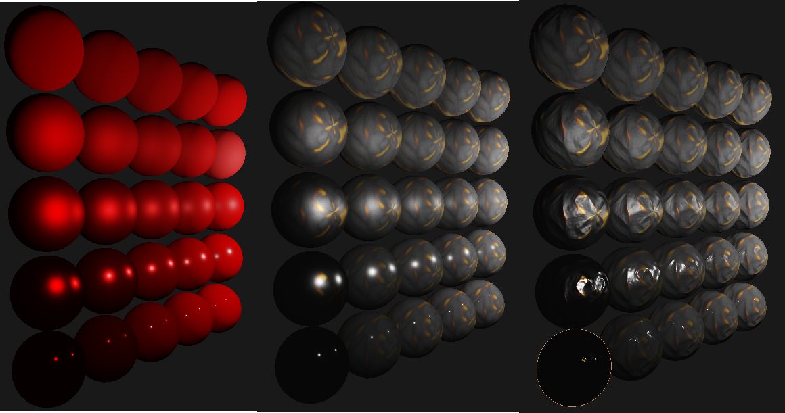

# SoulsEngine

## Introduction
*Ce dépôt a été créé pour un projet de Master 1 IMAGINE (Fac de science de Montpellier), l'objectif du projet est la 
création d'un moteur de jeu utilisant OpenGL. Le moteur de jeu vise un type de jeu particulier, en l'occurence celui-ci
a pour objectif de créer des jeux de type [Soulslike](https://en.wikipedia.org/wiki/Soulslike).
En plus d'OpenGL le moteur est construit en utilisant principalement GLFW, Glad, glm et Dear ImGUI (d'autre librairies 
sont utilisées et précisé [plus bas](#dependances) le tout en C++17. Le projet est simplement un objet d'apprentissage
pour le moment, il n'est absolument pas une référence en l'état, si vous cherchez des ressources intéressantes concernant les 
moteurs de jeux veuillez vous référer aux [références utilisées](#références-utilisées ).*

## Exemple (PBR)



## Fonctionnalitées (complétées ou non)

### Globales
- [X] Affichage 3D de maillage (chargement OFF pour l'instant)
- [X] Gestion de textures
- [ ] Gestion de lumières (En progression)
- [ ] Animation de maillage
- [ ] Détection de collision
- [ ] Moteur physique (gravité, réponse collisions)
- [X] Gestion interne d'évenements
- Optimisation graphiques
  - [ ] Frustum culling (En progression)
  - [ ] Octree de scene
- [X] Fonctionnement ECS 
- [ ] Interface d'édition (En progression)
### Soulslike
- [ ] Controlleur troisième personne (déplacement, roulade, attaques (?))
- [ ] Vérouillage de cible 
- [ ] Intéraction environnement

## Build
Le projet est géré avec CMake (version 3.14 minimum). Donc utilisable sous tout IDE pouvant exploiter CMake 
(CLion, Visual Studio, VSCode). OpenGL 3.3 est requis, les librairies externes sont gérées avec git submodule.
Après un clone il faut donc effectuer les deux commandes suivantes :
```
git submodule init
git submodule update
```

## Dependances
- [GLFW](https://github.com/glfw/glfw) (Gestion de fenêtre et inputs)
- [Glad](https://github.com/Dav1dde/glad) (API OpenGL)
- [glm](https://github.com/g-truc/glm) (Mathématiques)
- [ImGUI](https://github.com/ocornut/imgui/tree/docking) (Interface utilisateur)
- [spdlog](https://github.com/gabime/spdlog) (Logging)
- [stb_image](https://github.com/nothings/stb) (Chargement d'image)

## Auteurs
- Elye (Rikougo) - [git](https://github.com/Rikougo)
- Pierrhum - [git](https://github.com/Pierrhum)
- Benjamin Villa - [git]()

## Références utilisées 
- [Série de vidéo sur moteur de jeu de TheCherno](https://www.youtube.com/watch?v=JxIZbV_XjAs&list=PLlrATfBNZ98dC-V-N3m0Go4deliWHPFwT)
- [Gitbook sur collision, bounding box et autre](https://gdbooks.gitbooks.io/3dcollisions/content/)
- [Article sur les quaternions (vs rotor)](https://marctenbosch.com/quaternions/)
- [Nazarra Engine](https://github.com/DigitalPulseSoftware/NazaraEngine) 
  - *Et de l'aide précieuse de son créateur et d'autres membres du [Discord NotANumber](https://discord.gg/tf7UBES7) sur certains sujet globaux sur le C++ mais aussi de discussion sur le rendu, l'ECS, etc.*